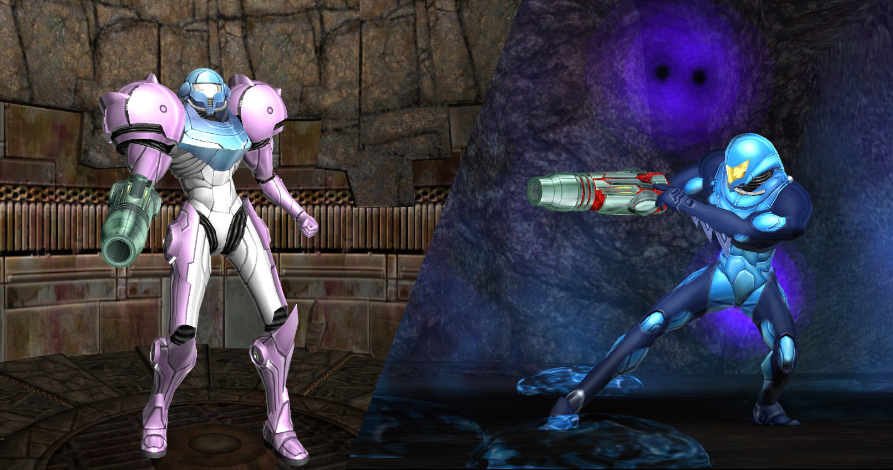

## Metroid Prime suit editor
by Azure Lazuline

v1.0.1

This makes a set of custom textures to load into Dolphin for custom suits in Prime 1.
Eventually i hope to get it integrated into Randovania, but for now it's standalone.
(If you're a randomizer dev, go for it! I can't do it on my own because of time
constraints nowadays, but i'd be glad to help if you contacted me.)

### Instructions

Run gui.py (or the Windows standalone executable), and the interface should be pretty
self-explanatory. You can save and load full sets of suits as a file, or copy
individual ones to your clipboard (to paste into another suit, or share it with
others).

Click "Export textures" when you're done, and select Dolphin's "User" directory so it
knows where to put the files. You can find it with "File -> Open User Folder" in
Dolphin. On Windows, this is most likely in AppData, but it can vary depending on
settings and OS.

Any time you change the colors, a set of preview images gets created in the "saved"
subdirectory (which is where your settings and saved palettes get put by default
too). I figured i'd expose them in case it's useful to show people your new suits!

### Known issues

Some of the morph ball colors like the internal energy aren't accessible through
textures, so it'd need a more extensive hack to change them. This means some of the
color settings do nothing currently, but i wanted to include them for future
compatibility.

This has only been tested on the original US release of the game (GM8E01). If you're
using another version, you may be able to select the custom textures folder for that
version directly (instead of Dolphin's base user folder), but it's untested.

### Change log

v1.0.0: initial release

v1.0.1: fixed a bug with detecting Dolphin's export directory